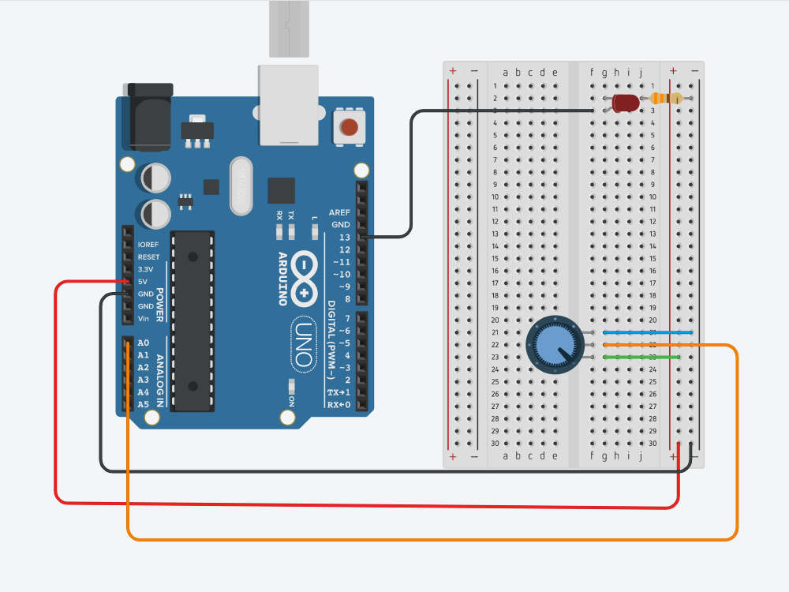

  # How to repeat?
  
 To repeat this project too, you have to have:
* Arduino UNO R3
* Breadboard
* USB Cable
* 4 Grove cables
* 1 LED
* 1 Resistor 330 Ω
* 1 Potentiometer analog 10K Ω
 
Next you have to follow this scheme: 

</png>

Write the code for your program, for this you can check "main.ino" file. Plug in your Arduino card. Upload your main.ino file to your Arduino and enjoy!

</png>
