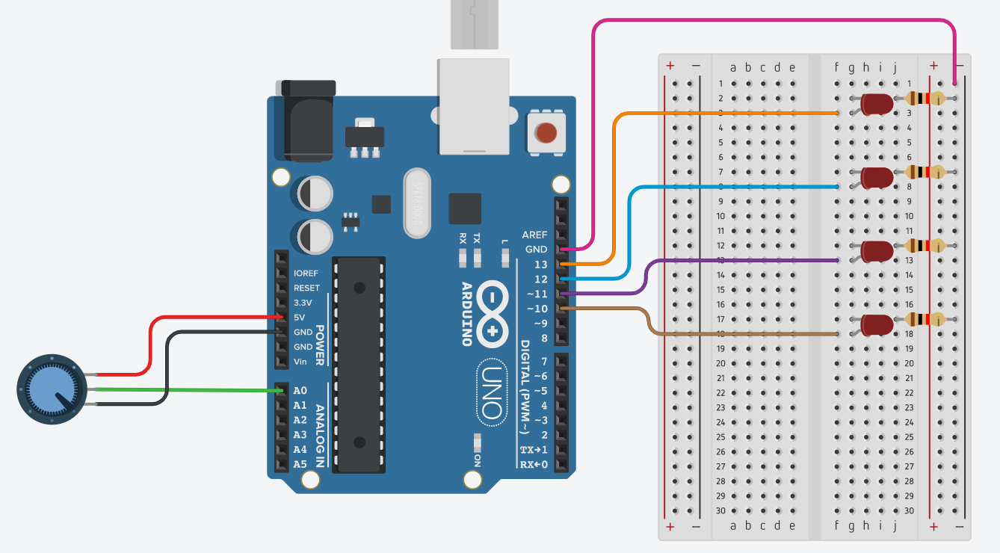

 # How to repeat?
  
 To do this project too, you have to have:
* Arduino UNO R3
* Breadboard
* USB Cable
* 5 Jumper wires (Male-Male)
* 3 Jumper wires (Male-Female)
* 4 LEDs
* 4 Resistors 220 Ω
* 1 Rotation potentiometer
 
Next you have to follow this <a href="https://github.com/Yashmerino/Arduino-Projects/blob/main/Turn%20on%20and%20off%20LEDs%20with%20potentiometer/scheme.png">scheme:</a> 

</png>

Write the code for your program, for this you can check <a href="https://github.com/Yashmerino/Arduino-Projects/blob/main/Turn%20on%20and%20off%20LEDs%20with%20potentiometer/main.ino">main.ino</a> file. Plug in your Arduino card. Upload your main.ino file to your Arduino and enjoy!

</png>
